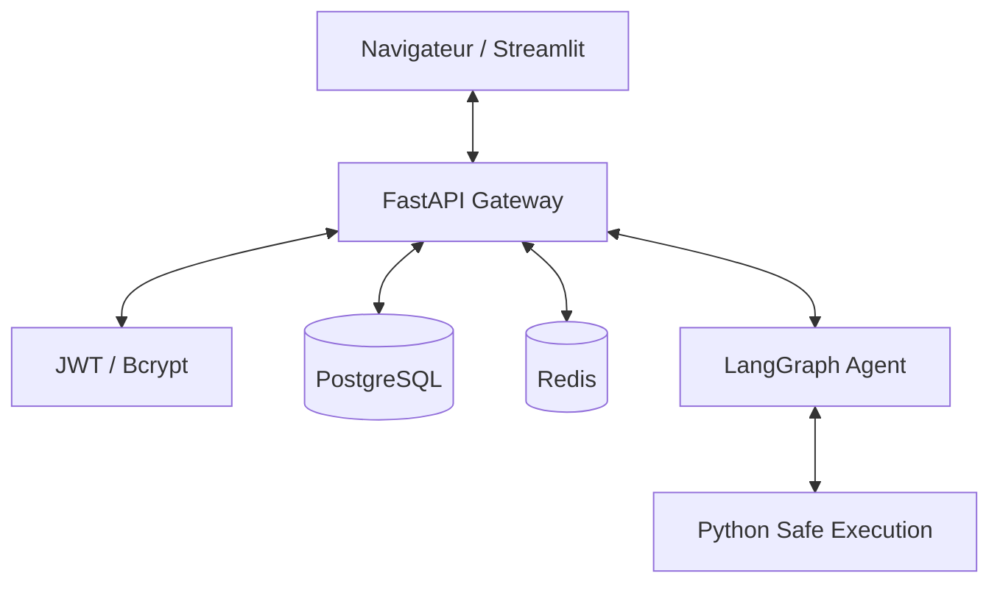

# Agentic Data Analysis Modernized Platform 🚀

Bienvenue dans la version modernisée de la plateforme d'analyse de données. Ce projet transforme un POC Streamlit fragile en une application SaaS robuste, sécurisée et scalable.

## ✨ Améliorations Clés

- **Persistance des Sessions** : Plus d'amnésie ! Vos conversations et visualisations sont sauvegardées dans PostgreSQL via FastAPI.
- **Sécurité Critique** : Exécution du code Python isolée dans un bac à sable (sandbox) contrôlé.
- **Multi-Utilisateurs** : Authentification complète par JWT et isolation stricte des données par utilisateur.
- **Architecture Scalable** : Séparation claire du Frontend (Streamlit) et du Backend (FastAPI, Redis, PostgreSQL).
- **Visualisations Persistantes** : Les graphiques Plotly sont stockés en JSON et rechargés à chaque réouverture de session.

## 🏗️ Architecture Cible



## 🚀 Démarrage Rapide

```bash
cp .env.example .env
# Mettre votre OPENAI_API_KEY dans .env
docker-compose up -d --build
```
Accédez à l'interface sur `http://localhost:8501`.

## 📚 Documentation
- [Audit Technique & Architecture](docs/ARCHITECTURE_ANALYSIS.md)
- [Guide d'Installation](docs/SETUP.md)
- [Référence API](docs/API.md)

## 🧪 Tests & Qualité
La plateforme inclut une suite de tests automatisée avec une couverture de **81%** :
```bash
pytest backend/tests/ -v --cov=backend
```
