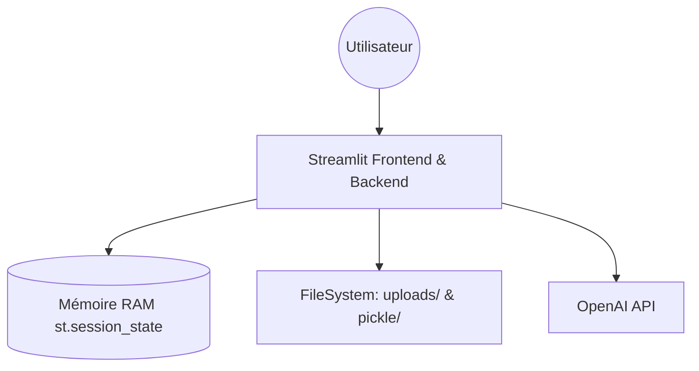
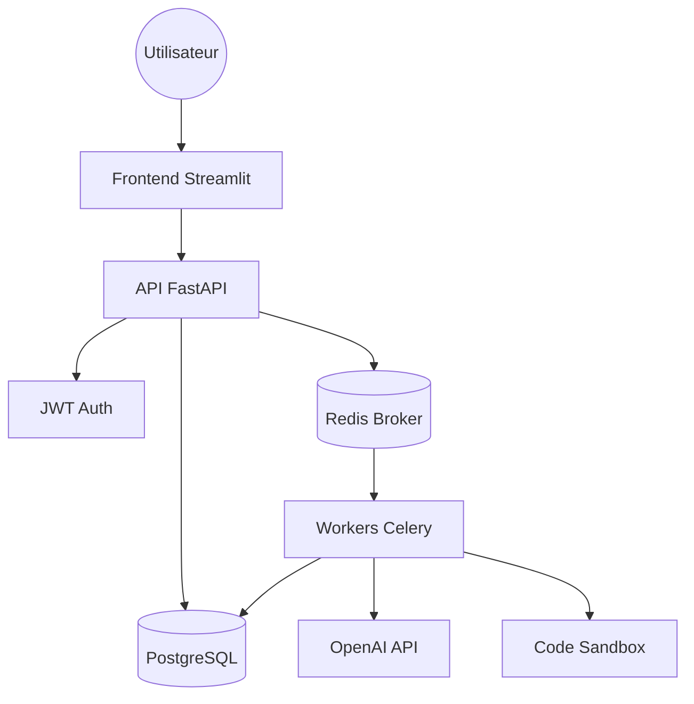

# Analyse d'Architecture : POC Actuel vs Système de Production Cible

## Résumé Exécutif
L'audit technique du prototype actuel a révélé des failles critiques qui empêchent un déploiement à grande échelle pour 500+ clients. Les principaux risques concernent la perte de données après redémarrage, l'absence totale d'isolation des données entre utilisateurs, de graves vulnérabilités d'exécution de code, une incapacité de mise à l'échelle horizontale et la volatilité des résultats d'analyse. La transition vers une architecture basée sur FastAPI, PostgreSQL, Redis et Celery est impérative.

## Analyse des Problèmes

### Problème 1 : Amnésie au Redémarrage
- **Découverte** : Lors du redémarrage de l'application, tout l'historique de conversation et le contexte du dataset sont perdus. L'agent ne reconnaît plus l'utilisateur ni les données précédemment traitées.
- **Cause Racine** : L'état de l'agent (`chat_history`, `intermediate_outputs`) est stocké uniquement en mémoire vive (RAM) via `st.session_state` et des variables d'instance de la classe `PythonChatbot` dans `Pages/backend.py`.
- **Impact Métier** : Frustration majeure des clients (Churn) qui doivent recommencer leur travail à chaque mise à jour ou incident serveur.
- **Solution Proposée** : Implémenter une persistance via PostgreSQL en utilisant `SQLAlchemy` pour stocker l'historique des messages et l'état des sessions.

### Problème 2 : Fuite de Données Multi-Utilisateurs
- **Découverte** : N'importe quel utilisateur accédant à l'interface peut voir et interagir avec les fichiers uploadés par d'autres utilisateurs dans le dossier `uploads/`.
- **Cause Racine** : Absence de système d'authentification et de gestion de sessions identifiées en backend. Tous les utilisateurs partagent le même répertoire de travail global sur le serveur.
- **Impact Métier** : Risque Légal critique (Violation RGPD). Fuite de données confidentielles entre entreprises concurrentes.
- **Solution Proposée** : Mettre en place une authentification JWT et isoler les ressources (fichiers, sessions) par `user_id` dans la base de données.

### Problème 3 : Sécurité de l'Exécution de Code
- **Découverte** : Il est possible d'exécuter des commandes système arbitraires (ex: `__import__('os').system('rm -rf /')`) via l'outil `complete_python_task`.
- **Cause Racine** : Utilisation de la fonction `exec()` sans aucun sandboxing ni filtrage sur des globaux non sécurisés dans `Pages/graph/tools.py`.
- **Impact Métier** : Risque de cybersécurité total. Un utilisateur malveillant peut prendre le contrôle du serveur, voler les clés API (OpenAI) ou détruire l'infrastructure.
- **Solution Proposée** : Utiliser un environnement restreint (RestrictedPython) ou, à minima, un dictionnaire de globaux strictement contrôlé avec un timeout d'exécution.

### Problème 4 : Goulot d'étranglement de Scalabilité
- **Découverte** : L'application ne peut pas être répliquée sur plusieurs serveurs sans perdre la cohérence des sessions.
- **Cause Racine** : L'état est "stateful" en mémoire locale. Streamlit n'est pas conçu pour être un backend sans état (stateless) capable de mise à l'échelle horizontale (Horizontal Scaling).
- **Impact Métier** : Indisponibilité du service dès que le nombre d'utilisateurs dépasse les capacités d'un seul serveur.
- **Solution Proposée** : Migrer la logique métier vers FastAPI (architecture stateless) et déporter les tâches lourdes vers des workers Celery/Redis.

### Problème 5 : Volatilité de l'Analyse
- **Découverte** : Les graphiques générés disparaissent après un rafraîchissement de page ou un redémarrage, car ils sont stockés temporairement sous forme de fichiers pickle locaux.
- **Cause Racine** : Stockage éphémère sur le système de fichiers local sans lien persistent en base de données dans `images/plotly_figures/pickle`.
- **Impact Métier** : Perte de valeur pour le client. Augmentation des coûts LLM car les analyses doivent être relancées inutilement.
- **Solution Proposée** : Stocker les définitions JSON des graphiques Plotly directement en base de données PostgreSQL.

## Comparaison d'Architecture

### Architecture Actuelle (POC)

### Architecture Cible (Production)

## Décisions Techniques

### Pourquoi FastAPI plutôt que Streamlit seul ?
FastAPI permet de séparer proprement le frontend du backend, offrant une architecture sans état (stateless) indispensable pour la scalabilité horizontale et l'intégration de services tiers (Auth, Workers).

### Pourquoi PostgreSQL pour la persistance ?
PostgreSQL est robuste, gère parfaitement les relations (utilisateurs, sessions, messages) et supporte le stockage JSON pour les graphiques Plotly.

### Pourquoi JWT pour l'authentification ?
JWT (JSON Web Tokens) permet une authentification stateless, facilitant la montée en charge et la sécurité sans avoir à stocker les sessions côté serveur.

### Pourquoi Celery pour les tâches asynchrones ?
Les analyses de données peuvent être longues. Celery évite de bloquer l'API, gère les files d'attente et permet une isolation des processus d'exécution de code.

## Réponses aux Questions de Conception

### 2.1 Fondation FastAPI
- **Pourquoi FastAPI au lieu de Streamlit ?** 
    - Streamlit est conçu pour des tableaux de bord interactifs "tout-en-un" mais ses capacités de backend sont limitées : pas de gestion native des routes, de l'authentification robuste, ou d'asynchronisme poussé. 
    - FastAPI permet une séparation nette entre le frontend et le backend, gère l'asynchronisme (`async/await`) nativement pour les tâches I/O (appels LLM) et facilite la création d'une API standardisée (OpenAPI).
- **Limites de Streamlit pour les API** : Streamlit relance tout le script à chaque interaction, ce qui rend la gestion d'un backend complexe inefficace et difficile à scaler. Il ne supporte pas nativement les requêtes HTTP externes provenant d'autres clients.
- **Scalabilité horizontale** : FastAPI étant "stateless" (sans état), plusieurs instances peuvent être lancées derrière un répartiteur de charge (Load Balancer). L'état est déporté dans une base de données externe (PostgreSQL) et un cache (Redis).
- **Stateful vs Stateless** : 
    - *Stateful* : Le serveur garde en mémoire les données de session. Si le serveur tombe, les données sont perdues.
    - *Stateless* : Chaque requête contient toutes les informations nécessaires (ou un token) pour être traitée. Le serveur ne garde rien en mémoire propre.
- **Middleware CORS** : Indispensable pour autoriser le frontend (Streamlit sur le port 8501) à requêter le backend (FastAPI sur le port 8000) lorsqu'ils sont sur des domaines/ports différents. Sans cela, le navigateur bloque les requêtes par sécurité. En production, `origins=["*"]` est dangereux car il permet à n'importe quel site de requêter votre API ; il faut restreindre au domaine spécifique.
- **Logging structuré vs print()** : Le logging structuré (JSON) permet d'injecter des métadonnées (ID de requête, User ID) et facilite l'analyse automatique des logs par des outils comme ELK ou Datadog pour déboguer des milliers de requêtes par minute.

### 2.2 Système d'Authentification
- **Hashage des mots de passe** : On ne stocke jamais les mots de passe en clair pour protéger les utilisateurs en cas de fuite de la base de données. On utilise des algorithmes comme `bcrypt` ou `argon2` qui sont "lents" par conception pour résister aux attaques par force brute. Si l'on tente de s'authentifier avec un mot de passe déjà haché, l'algorithme le re-hachera, ce qui ne correspondra pas au hash stocké.
- **JWT et Expiration** : 
    - Un token JWT sans expiration est une faille majeure : s'il est volé, l'attaquant a un accès permanent. 
    - Une expiration raisonnable (ex: 1 heure) limite la fenêtre d'exposition. On utilise des "refresh tokens" pour renouveler la session sans redemander les identifiants trop souvent.
