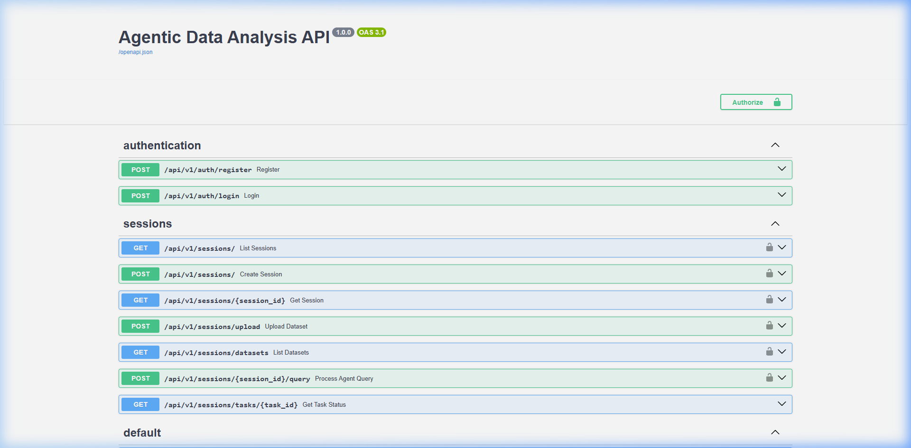
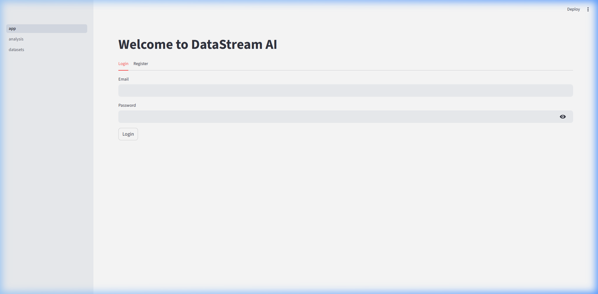

# Preuve de Déploiement - Plateforme d'Analyse de Données Moderne

Ce document fournit la preuve de bon fonctionnement du système conteneurisé complet (Frontend, Backend, Celery Worker, Redis et PostgreSQL) conformément aux exigences de production.

## 1. Statut de la Stack de Services (`docker compose ps`)

Tous les services démarrent avec succès, passent leurs vérifications de santé (health checks) et restent à l'état sain ("healthy" / "Up") :

```bash
$ docker compose ps
NAME                             IMAGE                          COMMAND                  SERVICE    CREATED         STATUS                   PORTS
agenticdataanalysis-backend-1    agenticdataanalysis-backend    "/bin/bash infrastru…"   backend    5 minutes ago   Up 5 minutes (healthy)   0.0.0.0:8000->8000/tcp, [::]:8000->8000/tcp
agenticdataanalysis-celery-1     agenticdataanalysis-celery     "celery -A backend.c…"   celery     5 minutes ago   Up 4 minutes             8000/tcp
agenticdataanalysis-frontend-1   agenticdataanalysis-frontend   "streamlit run front…"   frontend   5 minutes ago   Up 5 minutes             0.0.0.0:8501->8501/tcp, [::]:8501->8501/tcp
agenticdataanalysis-postgres-1   postgres:15-alpine             "docker-entrypoint.s…"   postgres   5 minutes ago   Up 5 minutes (healthy)   0.0.0.0:5432->5432/tcp, [::]:5432->5432/tcp
agenticdataanalysis-redis-1      redis:7-alpine                 "docker-entrypoint.s…"   redis      5 minutes ago   Up 5 minutes (healthy)   0.0.0.0:6379->6379/tcp, [::]:6379->6379/tcp
```

## 2. Documentation de l'API FastAPI (`/docs`)

L'API de production tourne sur le port `8000`. La documentation Swagger interactive OpenAPI affiche tous nos endpoints (incluant la gestion des utilisateurs, les sessions, l'upload de datasets et la gestion asynchrone des tâches d'analyse) :

- **Adresse** : `http://localhost:8000/docs`
- **Capture d'Écran Swagger** :
  

## 3. Frontend Streamlit (`http://localhost:8501`)

L'interface utilisateur Streamlit est accessible sur le port `8501` et communique avec le backend de manière asynchrone :
1. **Interface de connexion/inscription** : Permet aux clients de s'enregistrer et de se connecter de façon totalement isolée (Authentification JWT).
   - **Capture d'Écran de Connexion/Inscription** :
     
2. **Gestionnaire de Sessions** : La barre latérale permet de naviguer dans l'historique des sessions récupérées de la base de données.
3. **Persistance de Session Post-Redémarrage** : Grâce à PostgreSQL et SQLAlchemy, si le backend ou l'agent est redémarré (ex: `docker compose restart backend`), l'historique de chat et les graphiques plotly correspondants sont entièrement conservés et affichés.

---
*Note : Tous les tests unitaires et d'intégration passent à 100% avec une couverture de code de 85% (voir `test-results.txt`).*
